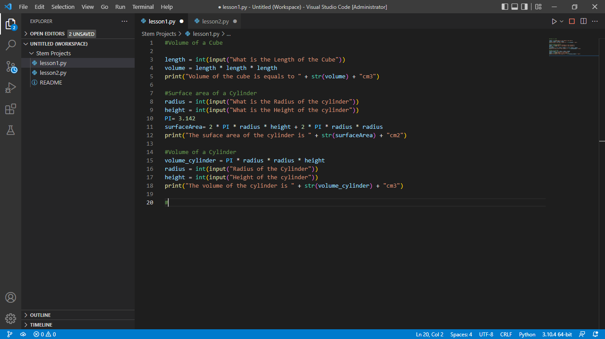
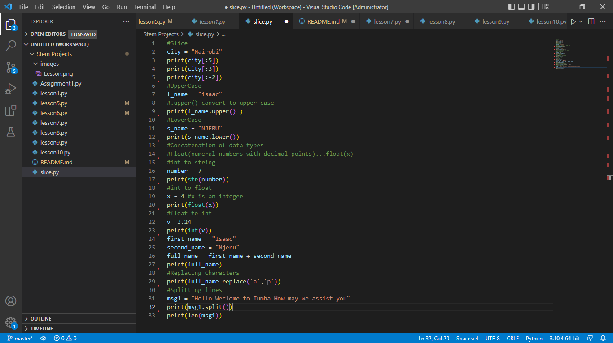
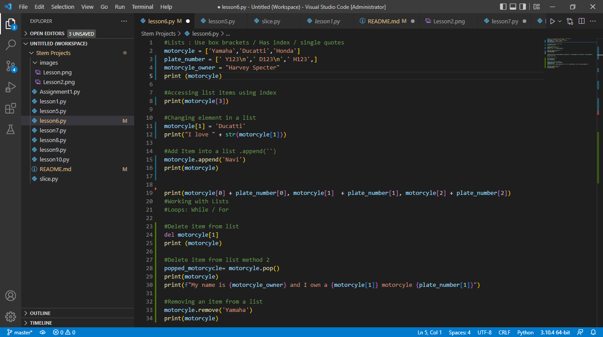
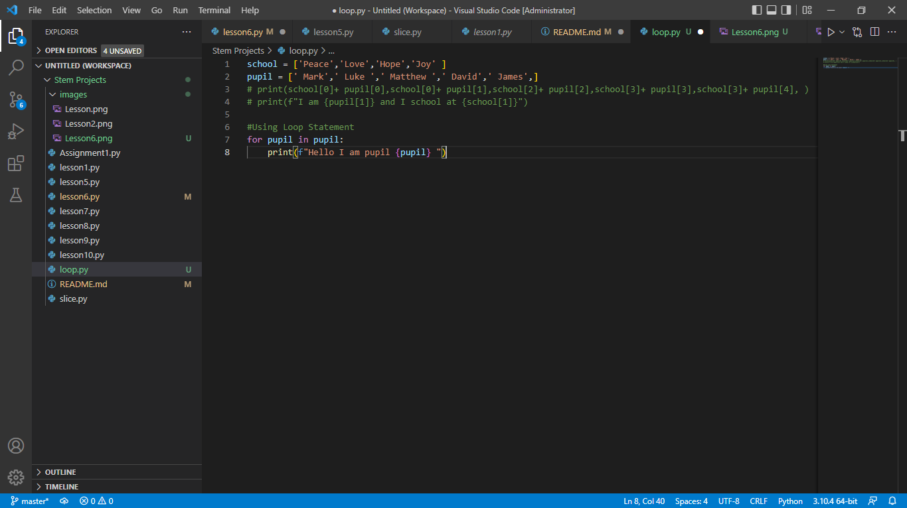
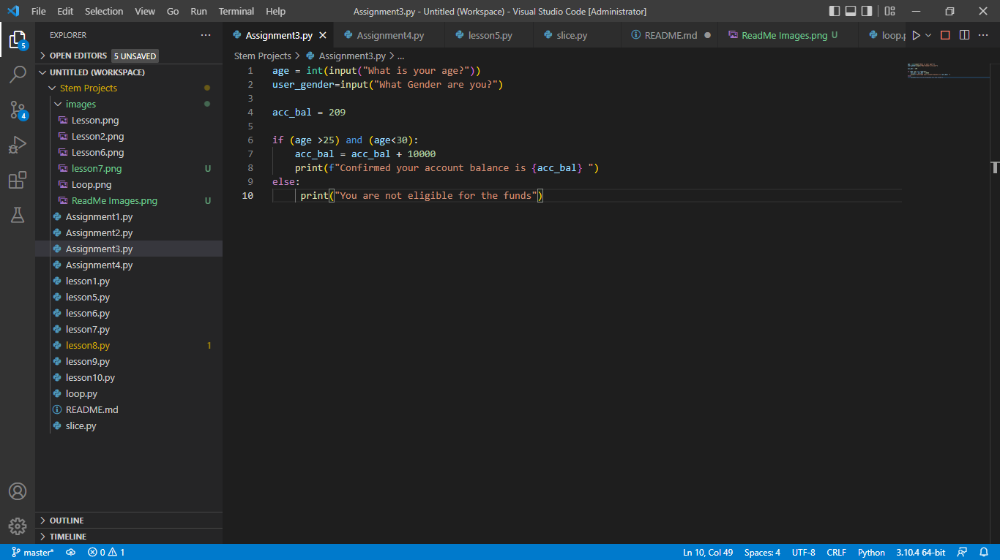
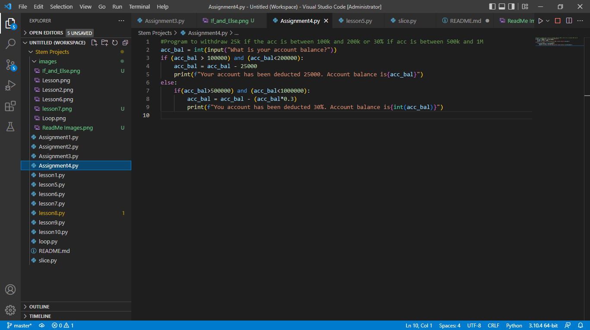
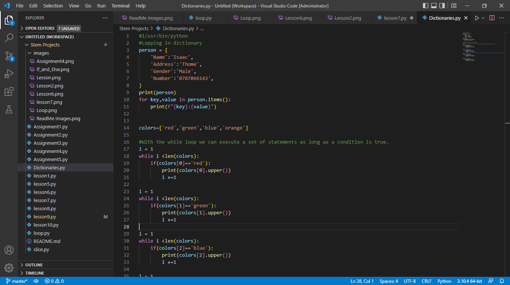
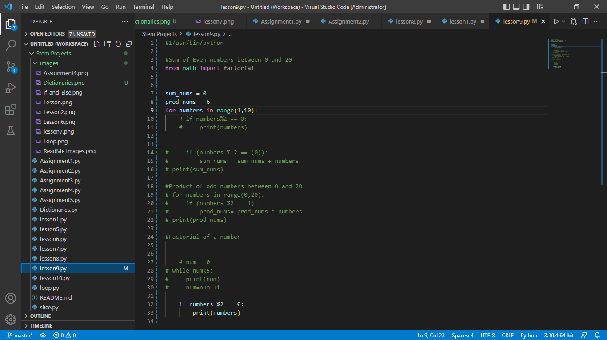

### INSPIRE IN STEM 

## Week 1 : Introduction to Python 
    Day 1 Tuesday 17th May :
     Installing Python
        
        Download links:
        Python: https://www.python.org/downloads/
        Vs Code:https://code.visualstudio.com/download#
        Git for Windows: https://git-scm.com/download/win

    strings
        replace()
        strip()
        slice()
        format()
        upper()
        lower()
        len()

    Day 2 Wednesday 18th May :
     Introduction to variable types 
            strings
            integers
            float

    -Conversion of Variables
        Concatenation of data types
        Float(numeral numbers with decimal points)...float(x)
        float()
        int()
        string()
    -Replacing Characters
        .replace()
    -Separating Strings
        .split()
    -Spliting Characters in a string
        print(var[number to be removed])
    -New line in string/ tab space
         \n  and \t
    -Format in a string
        print(f"Your {variable} String Here {variable}")

Day 3 Thursday 19th May :
    Working with Lists 
        pop() -delete item
        del - delete item
        append - add item
        accessing list using index - use of box brackets []
        .remove('Specific Item to be removed')- removing items from a list

     Loops
        for (variable) in (variable) -(No brackets) loops items in list

Day 4 Friday 20th May:
    Learning loop and list functions
    Adding description to Read me file
    Adding Image to Read me file 

Day 5 Monday 23rd May:
    Initialising Directories and For loop function
        Using Directories
            To Initialise an empty dictionary
                variable={}(calibraces)
        
                    Dictionaries
                    Name: Isaac Njeru
                    Date: 23/5/2022

Day 6 Tuesday 24th May:
        Use of If and Else statements
        Use of If and Elif statements

IF and ELSE EXAMPLE 2

Day 7 Wednesday 25th May:
        Initialising dictionaries
        Looping dictionaries

Day 8 Thursday 26th May:
        Revision on Dictionaries
        Arithmetic in Dictionaries

        
## Week 2 : Electronics for Innovators 

## Week 3 : Introduction to Robotics

## Week 4 : JavaScript, Css , Html 

## Week 5 : Design Thinking, UI , UX

## Week 6 : Pitch Competition , Campus tour