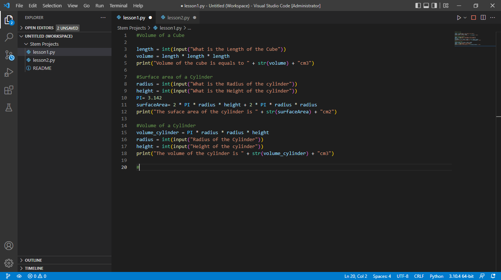

### INSPIRE IN STEM 

## Week 1 : Introduction to Python 
    Day 1 : Installing Python
        
        Download links:
        Python: https://www.python.org/downloads/
        Vs Code:https://code.visualstudio.com/download#
        Git for Windows: https://git-scm.com/download/win

    Assignment 1 Image

    

    strings
        replace()
        strip()
        slice()
        format()
        upper()
        lower()
        len()

    Day 2 : Introduction to variable types 

## Week 2 : Electronics for Innovators 

## Week 3 : Introduction to Robotics

## Week 4 : JavaScript, Css , Html 

## Week 5 : Design Thinking, UI , UX

## Week 6 : Pitch Competition , Campus tour